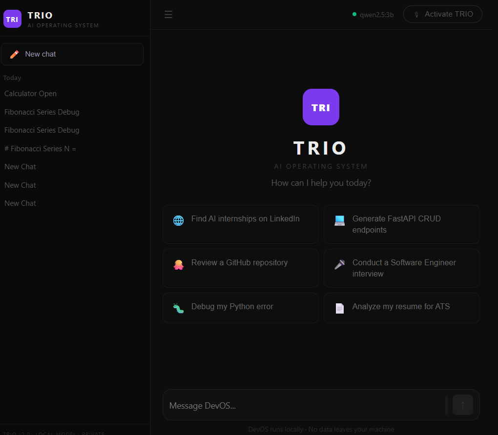
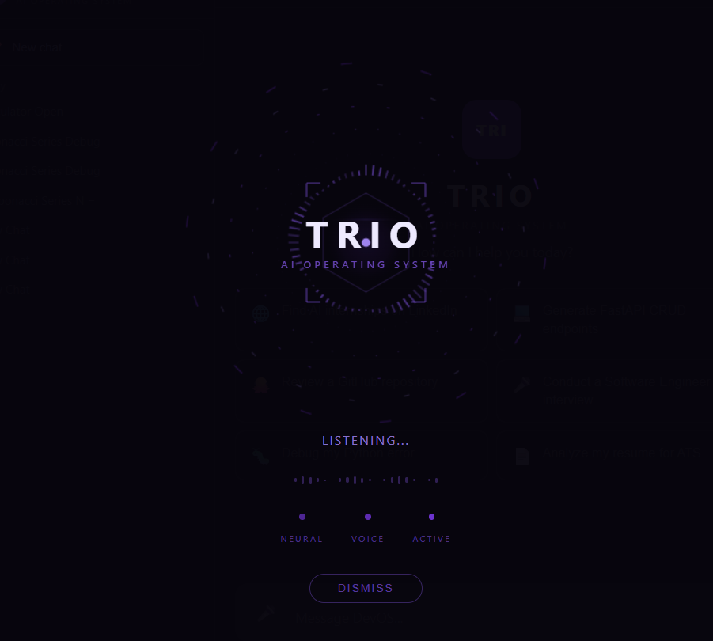
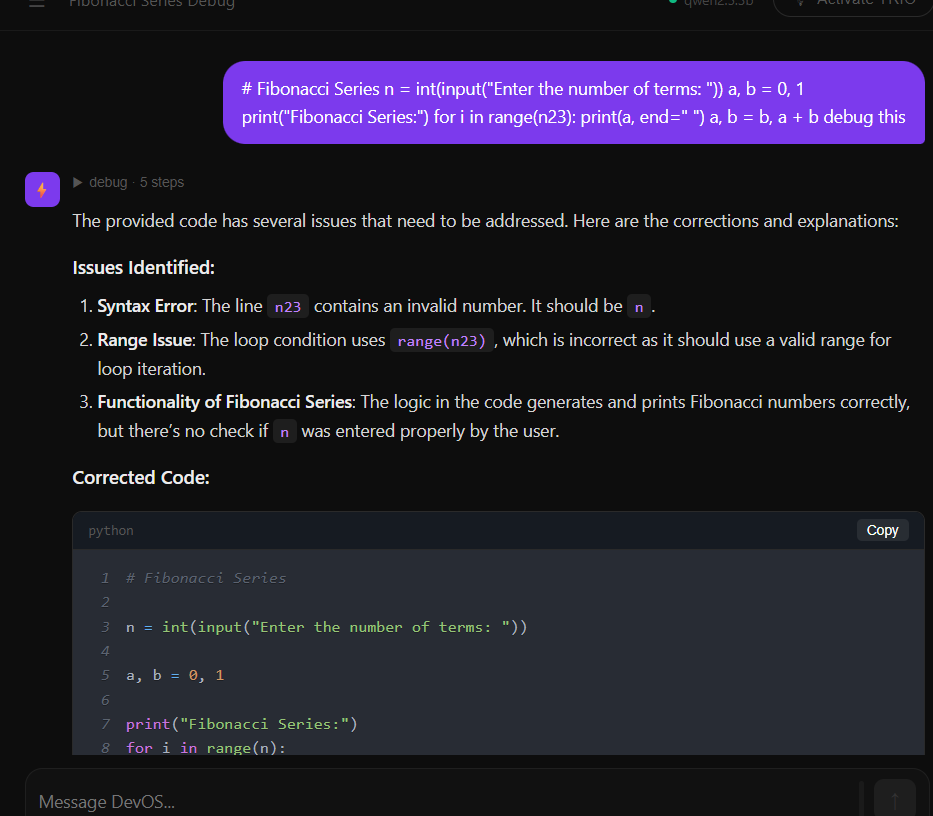

# 🚀 TRIO-AgenticAI

### A Local Multi-Agent AI Operating System

TRIO-AgenticAI is a local-first AI operating system that combines conversational AI, voice interaction, intelligent task routing, browser automation, system control, coding assistance, resume analysis, GitHub repository review, and interview preparation into a single platform.

The system uses a multi-agent architecture where a central manager agent analyzes user requests and dynamically routes them to specialized agents. By leveraging local LLMs through Ollama, TRIO focuses on privacy, extensibility, and real-world AI automation.

---

## ✨ Features

### 🤖 Multi-Agent Architecture

TRIO automatically analyzes user requests and selects the most suitable agent.

Available agents include:

* Chat Agent
* System Agent
* Browser Agent
* Coding Agent
* Debug Agent
* Resume Agent
* Interview Agent
* GitHub Agent

---

### 💬 Conversational AI

* Natural language conversations
* Context-aware responses
* Multi-turn interaction support
* Local LLM integration through Ollama

---

### 🎤 Voice Assistant

* Voice activation interface
* Speech-to-text processing
* Text-to-speech responses
* Voice and text commands supported simultaneously

---

### 🖥️ System Automation

Perform desktop operations such as:

* Open Chrome
* Open VS Code
* Open Calculator
* Open Notepad
* Open File Explorer

---

### 🌐 Browser Automation

* Open websites
* Search Google
* Search YouTube
* Find internships
* LinkedIn searches
* News searches

---

### 💻 Coding Assistant

Generate:

* FastAPI applications
* React components
* Full-stack projects
* Python scripts
* Algorithms
* APIs

---

### 🐞 Debug Assistant

* Analyze errors
* Explain stack traces
* Suggest fixes
* Troubleshoot code

---

### 📄 Resume Assistant

* ATS analysis
* Resume feedback
* Skill extraction
* Career guidance

---

### 🎯 Interview Assistant

* Mock interviews
* Technical questions
* Behavioral questions
* Answer evaluation

---

### 🧠 Memory System

* Conversation history
* Persistent memory
* Context retrieval
* ChromaDB integration

---

## 📸 Screenshots

### Main Dashboard

The central workspace where users can interact with TRIO using text commands, quick actions, and conversation history.



---

### Voice Interaction Mode

Voice-first interface with activation mode, speech recognition, and AI response generation.



---

### Debug Assistant

Example of the Debug Agent identifying issues in code and generating corrected solutions with explanations.



---

## 🏗️ System Architecture

```text
User Input (Voice / Text)
            │
            ▼
      Manager Agent
            │
            ▼
     Intent Detection
            │
 ┌──────────┼──────────┐
 │          │          │
 ▼          ▼          ▼
Chat     Browser    Coding
Agent     Agent      Agent
 │
 ▼
Local LLM (Ollama)
 │
 ▼
Response Generation
```

---

## 🧩 Agent Responsibilities

### Manager Agent

* Detects user intent
* Selects appropriate agents
* Coordinates execution
* Combines responses

### Chat Agent

Handles conversations, explanations, and general reasoning tasks.

### System Agent

Launches desktop applications and performs approved system actions.

### Browser Agent

Handles searches, websites, internships, YouTube interactions, and web automation.

### Coding Agent

Generates code, APIs, components, and software solutions.

### Debug Agent

Analyzes errors and provides fixes.

### Resume Agent

Evaluates resumes and provides career insights.

### Interview Agent

Conducts interview sessions and evaluates responses.

### GitHub Agent

Reviews repositories and provides development suggestions.

---

## ⚙️ Tech Stack

### Frontend

* React
* JavaScript
* Axios
* React Markdown
* Zustand

### Backend

* FastAPI
* Python
* Uvicorn
* Pydantic

### AI & ML

* Ollama
* Qwen Models
* Faster-Whisper
* ChromaDB

### Automation

* Playwright
* Browser Automation
* Desktop Automation

### Storage

* SQLite
* ChromaDB

---

## 📁 Project Structure

```text
TRIO-AgenticAI
│
├── DevOS
│   ├── backend
│   │   ├── agents
│   │   ├── api
│   │   ├── core
│   │   ├── memory
│   │   ├── voice
│   │   ├── main.py
│   │   └── requirements.txt
│   │
│   └── frontend
│       ├── src
│       ├── public
│       └── package.json
│
├── screenshots
│   ├── Home.png
│   ├── trio_Voice.png
│   └── ChatLog.png
│
├── README.md
└── .gitignore
```

---

## 🚀 Getting Started

### 1. Clone Repository

```bash
git clone https://github.com/Larapraneeth/TRIO-AgenticAI.git

cd TRIO-AgenticAI/DevOS
```

---

### 2. Backend Setup

```bash
cd backend

python -m venv venv

venv\Scripts\activate

pip install -r requirements.txt

python -m uvicorn main:app --reload
```

Backend runs on:

```text
http://127.0.0.1:8000
```

---

### 3. Frontend Setup

```bash
cd frontend

npm install

npm start
```

Frontend runs on:

```text
http://localhost:3000
```

---

### 4. Ollama Setup

Install Ollama and download a supported model:

```bash
ollama pull qwen2.5:3b
```

or

```bash
ollama pull qwen2.5:7b
```

Verify installation:

```bash
ollama list
```

---

## 🔮 Future Improvements

* Agent permission system
* Workflow automation
* Mobile deployment
* File management agent
* Multi-model support
* Enhanced browser automation
* Improved long-term memory

---

## 🎯 Project Goal

The goal of TRIO-AgenticAI is to explore agentic AI systems capable of intelligently routing tasks between specialized agents while operating primarily on local models for privacy, efficiency, and user control.

---

## 👨‍💻 Author

**Lara Praneeth Kondeti**

B.Tech Computer Science & Engineering

Indian Institute of Information Technology Surat

---

## 📜 License

This project is intended for educational, research, and learning purposes.
